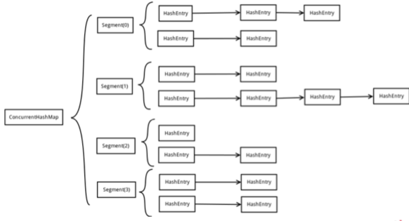
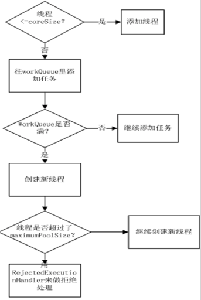
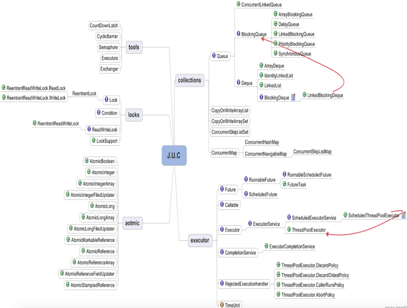

### jdk并发包里常用的类

---


* ConcurrentHashMap

	是线程安全的。
	
	Put方法，首先是对key.hashCode进行hash操作，得到hash值。然后获取对应的segment对象，接着调用Segment对象的put方法完成当前操作。当调用put方法时，首先lock操作，完成操作后再释放锁。
	
	http://ifeve.com/concurrenthashmap/



* Semaphore

	可以控制某资源同时被访问的个数。例如连接池中通常要控制创建连接的个数。
	
	tryAcquire方法，获得锁<br>
	release方法，释放锁

* CountdownLatch

	闭锁，确保一个服务不会开始，直到它依赖的其他服务都已近开始，它允许一个或多个线程，等待一个事件集的发生。
	通过减计数的方式，控制多个线程同时开始某个动作。当计数为0时，await后的代码才会被执行。
提供await（）和countDown（）两个方法。

* CyclicBarrier

	cyclicBarrier中的await方法会对count值减1，并阻塞当前线程（java.util.concurrent.locks.Condition.await()），如果count==0时先执行CyclicBarrier内部的Runnable任务（java.lang.Runnable.run()），然后唤醒所有阻塞的线程（java.util.concurrent.locks.Condition.signalAll()），count恢复初始值（可以进入下一轮循环）。
	
	与CountdownLatch不同的是，它可以循环重用。
	
```
import java.util.concurrent.CyclicBarrier;

public class TestCyclicBarrier {

    private static final int THREAD_NUM = 5;

    public static class WorkerThread implements Runnable {

        CyclicBarrier barrier;

        public WorkerThread(CyclicBarrier b){
            this.barrier = b;
        }

        @Override
        public void run() {
            try {
                System.out.println("Worker's waiting");
                // 线程在这里等待，直到所有线程都到达barrier。
                barrier.await();
                System.out.println("ID:" + Thread.currentThread().getId() + " Working");
            } catch (Exception e) {
                e.printStackTrace();
            }
        }

    }

    public static void main(String[] args) {
        CyclicBarrier cb = new CyclicBarrier(THREAD_NUM, new Runnable() {

            // 当所有线程到达barrier时执行
            @Override
            public void run() {
                System.out.println("Inside Barrier");
            }
        });

        for (int i = 0; i < 10; i++) {
            new Thread(new WorkerThread(cb)).start();
        }
    }

}
```
结果：

```
Worker's waiting
Worker's waiting
Worker's waiting
Worker's waiting
Worker's waiting
Inside Barrier
ID:13 Working
ID:9 Working
ID:12 Working
ID:11 Working
ID:10 Working
Worker's waiting
Worker's waiting
Worker's waiting
Worker's waiting
Worker's waiting
Inside Barrier
ID:18 Working
ID:14 Working
ID:16 Working
ID:15 Working
ID:17 Working

```


* AtomicInteger

	原子操作，线程安全。之前如果多线程累计计数，需要通过锁控制。
IncrementAndGet方法，关键是调用了compareAndSwap方法，是native方法，基于cpu的CAS原语来实现的。简单原理是由cpu比较内存位置上的值是否为当前值，如果是换成新值，否则返回false

* ThreadPoolExecutor

	提供线程池服务，ThreadPoolExecutor（int corePoolSize, int maximumPoolSize,long keepAliveTime, TimeUnit unit,BlockingQueue<Runnable> workQueue,RejectedExecutionHandler handler）

```
corePoolSize： 线程池维护线程的最少数量
maximumPoolSize：线程池维护线程的最大数量
keepAliveTime： 线程池维护线程所允许的空闲时间
unit： 线程池维护线程所允许的空闲时间的单位
workQueue： 线程池所使用的缓冲队列
handler： 线程池对拒绝任务的处理策略
```
```
block queue有以下几种实现：
1. ArrayBlockingQueue：有界的数组队列
2. LinkedBlockingQueue：可支持有界、无界的队列，使用链表实现
3. PriorityBlockingQueue：优先队列，可对任务排序
4. SynchronousQueue：队列长度为1的队列，和Array有点区别就是：client 线程提交到 block queue会是一个阻塞过程，直到有一个消费线程连接上来poll task

RejectExecutionHandler是针对任务无法处理时的一些自我保护处理：
1.	Reject 直接抛出Reject exception
2.	Discard 直接忽略该runnable，不建议使用
3.	DiscardOldest 丢弃最早入队列的任务
4.	CallerRuns 直接让原先的client thread做为消费线程，象同步调用方式一样，自己来执行。

```

 


**如何确定最大线程数？**

确定线程数首先需要考虑到系统可用的处理器核心数：

Runtime.getRuntime().availableProcessors();
应用程序最小线程数应该等于可用的处理器核数。

如果所有的任务都是计算密集型的，则创建处理器可用核心数这么多个线程就可以了，这样已经充分利用了处理器，也就是让它以最大火力不停进行计算。创建更多的线程对于程序性能反而是不利的，因为多个线程间频繁进行上下文切换对于程序性能损耗较大。

如果任务都是IO密集型的，那我们就需要创建比处理器核心数大几倍数量的线程。为何？当一个任务执行IO操作时，线程将被阻塞，于是处理器可以立即进行上下文切换以便处理其他就绪线程。如果我们只有处理器核心数那么多个线程的话，即使有待执行的任务也无法调度处理了。

因此，线程数与我们每个任务处于阻塞状态的时间比例相关。加入任务有50%时间处于阻塞状态，那程序所需线程数是处理器核心数的两倍。我们可以计算出程序所需的线程数，公式如下：

线程数=CPU可用核心数/（1 - 阻塞系数），其中阻塞系数在在0到1范围内。

计算密集型程序的阻塞系数为0，IO密集型程序的阻塞系数接近1。
确定阻塞系数，我们可以先试着猜测，或者采用一些性能分析工具或java.lang.management API 来确定线程花在系统IO上的时间与CPU密集任务所耗的时间比值。
         
         
* Executors
	
	工具类，提供大量管理线程执行器的工厂方法。

	newFixedThreadPool(int) ,创建固定大小的线程池

	newSingleThreadPool(),创建大小为1的线程池,同一时刻执行的task只有一个，其它的都放在阻塞队列中。

	newScheduledThreadPool(int),适用于一些需要定时或延迟的任务。与Timer的区别：
Timer是单线程，一旦一个task执行慢，将会影响其它任务。另外如果抛出异常，其它任务也不再执行。
ScheduledThreadPoolExecutor可执行callable的task，执行完毕后得到执行结果。任务队列是基于DelayedWorkQueue实现，将有新task加入时，会按执行时间排序。

* FutureTask

	用于异步获取执行结果或取消执行任务。通过传入Callable给FutureTask，直接调用run方法执行，之后可以通过FutureTask的get异步方法获得执行结果。FutureTask即使多次调用了run方法，它只会执行一次Callable任务，当然也可以通过cancel来取消执行。
《分布式java应用》P158

* ArrayBlockingQueue

	基于数组、先进先出、线程安全的集合


* CopyOnWriteArrayList

	线程安全，读操作时无锁的ArrayList。每次新增一个对象时，会将创建一个新的数组（长度+1），将之前的数组中的内容复制到新的数组中，并将新增的对象放入数组末尾。最后做引用切换。
	
* CopyOnWriteArraySet

	与上面的类似，无非在add时，会调用addIfAbsent，由于每次add时都要进行数组遍历，因此性能会略低于CopyOnWriteArrayList

* ReentrantLock

	单锁。控制并发的，和synchronized达到的效果是一致的。
Lock方法，借助于CAS机制来控制锁。
Unlock方法，释放锁

* ReentrantReadWriteLock

	与ReentrantLock没有任何继承关系，提供了读锁和写锁，在读多写少的场景中大幅度提升性能。
	
	持有读锁时，不能直接调用写锁的lock方法<br>
	持有写锁时，其他线程的读或写都会被阻塞。
	
	ReentrantReadWriteLock  lock=new ReentrantReadWriteLock();
WriteLock  writeLock=lock.writeLock();
ReadLock   readLock=lock.readLock();
《分布式java应用》P165

* 如何避免死锁

	1.制定锁的顺序，来避免死锁（先A后B，避免A->B和B->A同时存在）；
	
	2.尝试使用定时锁（lock.tryLock(timeout)）
	
	3.在持有锁的方法中进行其他方法的调用，尽量使用开放调用（当调用方法不需要持有锁时，叫做开放调用）
	
	4.减少锁的持有时间、减小锁代码块的粒度。


#### 汇总



#### 资料

* [并发编程 ：Concurrent 用户指南 ( 上 )](https://mp.weixin.qq.com/s/sF1xZY9ZrLVOXvTD4jiHRA)
* [并发编程 ：Concurrent 用户指南 ( 中 )](https://mp.weixin.qq.com/s/BrI7y7gKaBTDdtLm15ezzw)
* [并发编程 ：Concurrent 用户指南 ( 下 )](https://mp.weixin.qq.com/s/XxTazsHStb7BwjUxKflpdA)

