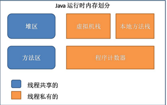
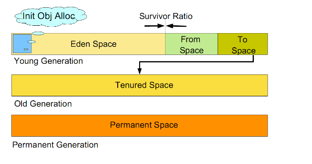

## jvm内存结构

---

####虚拟机运行时的数据区


a）程序计数器（program counter register），一块较小的内存空间，可以看作当前线程所执行的字节码的行号指示器。由于java虚拟机是采用多线程，通过线程切换获得时间片得到cpu的控制权。为了线程切换后能恢复到正确的执行位置。

b）虚拟机栈，调用一个方法时会创建一个栈帧，用于存储局部变量、对象引用、方法返回值，每一个方法从调用到执行完成，就对应着一个栈帧在虚拟机栈中入栈到出栈的过程。通过 -Xss控制大小，如果线程请求的栈深度大于虚拟机所允许的深度，会抛出StatckOverflowError。
通过递归死锁会引发这种问题。

c）本地方法栈，与虚拟机栈相似，主要是针对native方法服务。

d）堆（heap），所有线程共享，通过new操作产生对象，存放对象实例，分为年轻代（eden、两个survivor）和年老代，通过-Xmx和-Xms控制大小，如果内存不足会抛OutOfMemoryError。通过GC释放

e）方法区：主要是类信息、常量、静态变量，也叫持久代，通过-XXMaxPerSize控制大小，当方法区无法满足内存分配需求时也会抛出OutOfMemoryError。特别注意动态代理子类，在运行期会创建很多新的子类，导致空间不足。




* Young GC 

	Eden Space 满了 ；Survivor Space 满了

* Full GC

	老年代满了；持久代满了
	
```
jstat –gcutil  进程ID  刷新时间（可以实时监控jvm 的gc情况)
```