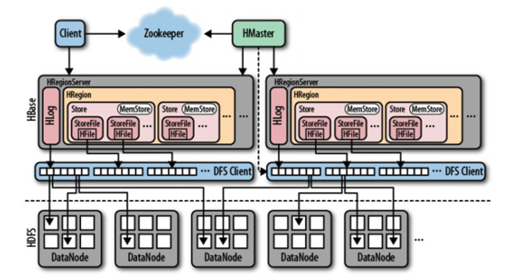
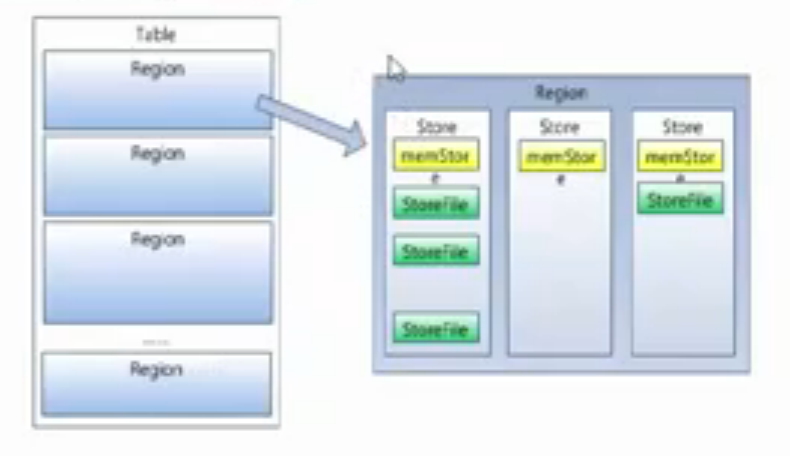

## Hbase

---

### 附录：

* [Hbase安装](http://blog.csdn.net/itomge/article/details/9970833)
* 《HBase企业应用开发实战》
* [Hbase官网](http://hbase.apache.org/)
* [Hbase官方文档中文版](http://abloz.com/hbase/book.html)
* [Hbase视频课程](https://edu.aliyun.com/course/73/learn?spm=0.0.0.0.k89hlH#lesson/978)
* [HBase 深入浅出](https://www.ibm.com/developerworks/cn/analytics/library/ba-cn-bigdata-hbase/index.html)
* [HBase详细概述](https://mp.weixin.qq.com/s/t6B0qcvq1PzkvXujv8jpUg)
* [HBase全网学习资料汇总](https://mp.weixin.qq.com/s/-kNKEpsATKgr_66IMS7KEw)


Phoenix

* [源代码](https://github.com/apache/phoenix)
* [官网地址](http://phoenix.apache.org/)
* [Apache Phoenix介绍（SQL on HBase）](http://www.jianshu.com/p/d862337247b1)
* [Phoenix使用指南](http://blog.csdn.net/huanggang028/article/details/12563481)
* [使用Phoenix通过sql语句更新操作hbase数据](http://www.ixirong.com/2015/06/24/how-hbase-use-apache-phoenix/)

-----

####  简介

HBase是一个开源的非关系型分布式数据库（NoSQL），基于谷歌的BigTable建模，是一个高可靠性、高性能、高伸缩的分布式存储系统，使用HBase技术可在廉价PC Server上搭建起大规模结构化存储集群。

HBase最初是以Hadoop子项目的形式进行开发建设，底层依赖于HDFS组件作为其存储系统（在 HDFS 中的数据默认会有 3 份），直到2010年5月才正式成为Apache的顶级项目独立发展。



#### 使用场景

* 存储大量的数据（PB级别）
* 写吞吐量大，瞬间写入量很大
* 优雅数据扩展，动态扩展整个存储系统容量
* 数据格式无限制，支持半结构化和非结构化的数据
* 业务场景简单，不需要全部的关系型数据库的特征，如交叉列、交叉表、事务、连接等


#### 与关系型数据库的差异

* 数据按行存储
* 没有索引的查询使用大量的I/O
* 建立索引和物化视图需要大量的资源

#### 数据模型

* Rowkey

	Hbase通过行键（Rowkey）检索数据，仅支持单行事务，单表可以有百亿行、百万列，数据矩阵横向和纵向两个维度所支持的数据量级都很有弹性。 RowKey按照字典顺序排序的，且只能存储64K的字节数据。

```
HBase只能在RowKey上建立索引。非RowKey的访问，只能全表扫描。
RowKey是以字典顺序由小到大的排序。
RowKey尽量散列，可以保证数据都不在一个Region上，从而避免读写的压力集中在个别Region。
RowKey的长度尽量短。
```

* 列族

	Hbase把同一个列族里面的数据存储在同一个目录下，由几个文件保存；权限控制、存储以及调优都是在列族层面进行的。
	
* timestamp时间戳

	每个cell存储单元对同一份数据有多个版本（每个单元格默认有 3 个时间戳的版本数据），根据唯一的时间戳来区分每个版本间的差异，不同版本的数据按时间倒序排序，最新的数据版本在最前面。时间戳类型是64位整型。由Hbase自动赋值。

* cell单元格

	由行和列的坐标交叉决定。内容是未解析的字节数组。

* HLog
	
	记录操作动作，以及value值，用于容灾。

####  组成部分


* 主节点HMaster

	在HBase中可以启动多个HMaster，通过选举机制保证只有一个Master正常运行并提供服务。HMaster主要负责Tabel和Region的管理工作。

```
管理用户对Table的增、删、改、查操作
管理RegionServer的负载均衡，调整Region分布
在Region分裂后，负责新Region的分配
在RegionServer死机后，负责失效的RegionServer上的Region迁移
```

* RegionServer

	负责响应用户的I/O请求，向HDFS文件系统读写数据，是HBase最核心模块。内部管理了一系列Region。	
	负责切分在运行过程中变得过大的region。

* Region

	一个Region由多个store组成，一个store对应了Table中的一个列族的存储。可以看出每个列族其实就是一个存储单元，因为最好将共同I/O特性的列放在一个列族中，保证高效读写。

	Store由两部分组成，MemStore和StoreFile。用户写入的数据首先会放入MemStore，当满了后会缓冲成一个StoreFile，当StoreFile 文件的数量增长到一定的阈值，系统会进行合并。

	Hbase自动把表水平划分成多个区域（region），每个region会保存一个表里面某段连续的数据。每个表开始只有一个region，随着数据不断插入表，region不断增大，当增大到一个阀值时，region会等分成两个新的region（裂变）。当table的行不断增多，就会有越来越多的region。这样一张完整的表被保存在多个Regionserver上。

	客户端检索数据，先在memstore找，找不到再找storefile。
	
	

	**图中示例：表有3个列族，也就对应3个store，组成一个region，表示一个表的某个区间范围rowkey对应的记录。**
	

* 客户端client

	客户端使用HBase的RPC机制与HMaster和RegionServer进行通信，客户端支持java接口、Thrift、Rest等多种形式

* 协调服务组件ZooKeeper

	* 负责管理HBase中多个HMaster的选举、服务器之间状态同步，保证任何时候，集群中只有一个master
	* 存储所有的Region的寻址入口
	* 实时监控Region server的上线和下线信息，并实时通知Master
	* 存储Hbase的schema和table元数据


#### Schema设计要点

行键设计：

* 避免单调递增行键。主要是为了防止数据过于集中在一个Region上。
* 行键与列族的关系。行键与列族是一对多关系，同一个行键可以在同一个表的每个列族中存在而不会冲突。
* 行键的长度
* 行键永远不变
* 尽量最小化行键长度

列族的设计：

* 列族的数量。尽量让你的列族数量少一些，通常只有一个
* 列族名长度。尽量减少长度，最好是一个字符，比如“d”
* 列族的基数（即行数）。如果表存在多个列族，列族A有100万行，列族B有10亿行，列族A可能被分散到很多Region中，导致扫描列族A时性能低下。


#### Hbase支持的客户端

* HBase提供的原生java客户端。涵盖了增、删、改、查等所有的API。
* 使用HBase Shell来操作HBase
* 使用Thrift客户端来访问HBase
* 通过Rest客户端来访问HBase

#### 常用命令

* Get

	get（）方法默认一次取回该行全部列的数据，我们也可以限定只取回某个列族的列的数据，或者进一步限定只取回某些列的数据

* Put

	如果RowKey是新的表示插入，否则表示更新

* Scan

	与get方法类似，可以指定startRow参数来定义扫描读取HBase表的起始行键，同时可选stopRow参数来限定读取到何处停止。

* Delete

	删除数据。与关系型数据库的delete操作不同，HBase的Delete操作可以指定删除某个列族或者某个列，或者指定某个时间戳，删除比这个时间早的数据。

* flush

	强制将memstore中的数据刷到storeFile中。
	
	```
	1. 安装hbase后，修改数据存储目录，编辑 conf/hbase-site.xml 配置hbase.rootdir 为/Users/onlyone/software/temp/hbase
	2. flush '表名'
	3. hbase hfile -p -f 74ca443e934c4b4bbf6c7fa4b899d16a 解压查看存储的数据
	
	
	```
	

#### 过滤器

过滤器可以根据列族、列、版本等更多的条件来对数据进行过滤，带有过滤条件的RPC查询请求会把过滤器分发到各个RegionServer中，可以降低网络传输的压力。

* 比较器：作为过滤器的核心组成之一，用于处理具体的比较逻辑，例如字节级的比较、字符串级的比较。

	* RegexStringComparator（正则表达式的值比较）
	* SubstringComparator（用于检测一个子串是否存在于值中，不区分大小写）
	* BinaryPrefixComparator
	* BinaryComparator

* 列值过滤器
	* SingleColumnValueFilter
	* SingleColumnValueExcludeFilter
* 键值元数据过滤器
	* FamilyFilter
	* QualifierFileter
	* ColumnPrefixFilter
	* MultipleColumnPrefixFilter
	* ColumnRangeFilter
	* DependentColumnFilter
* 行键过滤器
	* RowFilter
	* RandomRowFilter
* 功能过滤器
	* PageFilter
	* FirstKeyOnlyFilter
	* KeyOnlyFilter
	* InclusiveStopFilter
	* ColumnPaginationFilter


#### 使用建议

* 当客户端需要频繁的写一张表，随机的 RowKey 会获得更好的性能。
* 当客户端需要频繁的读一张表，有序的 RowKey 则会获得更好的性能。
* 对于时间连续的数据（例如 log），有序的 RowKey 会很方便查询一段时间的数据（Scan 操作）
* 大多数的情况下，一个表格不会超过 2 到 3 个 CF，而且很多情况下都是 1 个 CF 就足够了。	
	