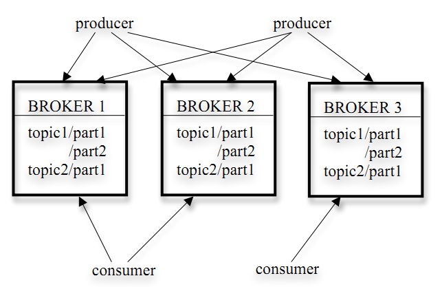
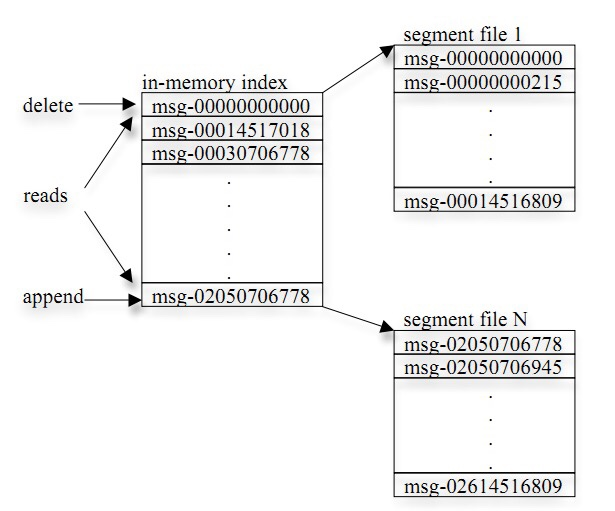
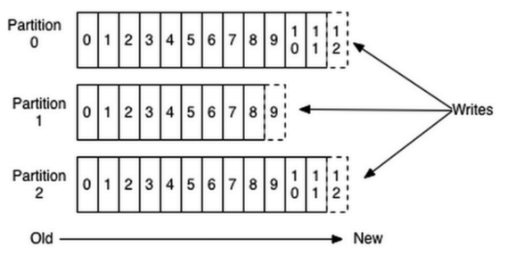

## kafka相关

---

Kafka是由LinkedIn开发的一个开源分布式基于发布/订阅的消息系统，Scala编写。
Producer向broker push消息；Consumer从broker pull消息（pull模式则可以根据Consumer的消费能力以适当的速率消费消息）

**目标：**

* 以时间复杂度为O(1)的方式提供消息持久化能力，即使对TB级以上数据也能保证常数时间复杂度的访问性能。
* 高吞吐率。即使在非常廉价的商用机器上也能做到单机支持每秒100K条以上消息的传输。
* 支持Kafka Server间的消息分区，及分布式消费，同时保证每个Partition内的消息顺序传输（注意：非整体有序，如果有顺序要求，可以只配置一个partition）。
* 同时支持离线数据处理和实时数据处理。

**核心组件：**

* 	Broker

	Kafka集群包含一个或多个服务器，这种服务器被称为broker

*	 Topic

	每条发布到Kafka集群的消息都有一个类别，这个类别被称为Topic，逻辑上可称之为队列（物理上不同Topic的消息分开存储，逻辑上一个Topic的消息虽然保存于一个或多个broker上但用户只需指定消息的Topic即可生产或消费数据而不必关心数据存于何处）

*	Partition
	
	Partition是物理上的概念，每个Topic包含一个或多个Partition，每个Partition对应一个逻辑log，由多个segment组成。
	
	
	
	

*	Producer

	负责发布消息到Kafka broker

*	Consumer
	
	消息消费者，向Kafka broker读取消息的客户端。

*	Consumer Group

	每个Consumer属于一个特定的Consumer Group（可为每个Consumer指定group name，若不指定group name则属于默认的group），会维护一个索引，用于标识一个消费集群的消费位置。为了对减小一个consumer group中不同consumer之间的分布式协调开销，指定partition为最小的并行消费单位，即一个group内的consumer只能消费不同的partition。
	
---

	
发到某个topic的消息会被均匀的分布到多个Partition上（随机或根据用户指定的回调函数进行分布），broker收到发布消息往对应Partition的最后一个segment上添加该消息，segment达到一定的大小后将不会再往该segment写数据，broker会创建新的segment。

每条消息都被append到该Partition中，属于顺序写磁盘，因此效率非常高（经验证，顺序写磁盘效率比随机写内存还要高，这是Kafka高吞吐率的一个很重要的保证）。

Kafka集群会保留所有的消息，无论其被消费与否。两种策略删除旧数据：

* 一基于时间的SLA(服务水平保证)，消息保存一定时间（通常为7天）后会被删除
* 二是基于Partition文件大小，可以通过配置$KAFKA_HOME/config/server.properties

	
	
	
	

	
**参考资料：**

http://www.infoq.com/cn/articles/kafka-analysis-part-1